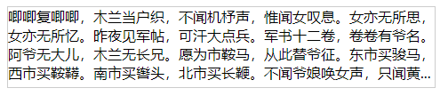

## vue-lines-ellipsis
多行文本溢出，用省略号展示。

## 安装
```git
npm install vue-lines-ellipsis
```

## 使用
### 1. 设置最大行数
> 设置最大行数时，此时展示与父级元素的高度无关，主要是根据 `line-height` 来计算, 所以请确保设置了 `line-height`;


```vue
<template>
  <div class="test">
    <VueLinesEllipsis :text="text" :maxLine="3" />
  </div>
</template>

<script>
import VueLinesEllipsis from "vue-lines-ellipsis";

export default {
  components: {
    VueLinesEllipsis
  },
  data() {
    return {
      text: '唧唧复唧唧，木兰当户织，不闻机杼声，惟闻女叹息。女亦无所思，女亦无所忆。昨夜见军帖，可汗大点兵。军书十二卷，卷卷有爷名。阿爷无大儿，木兰无长兄。愿为市鞍马，从此替爷征。东市买骏马，西市买鞍鞯。南市买辔头，北市买长鞭。不闻爷娘唤女声，只闻黄河之水鸣溅溅。'
    }
  }
}
</script>

<style>
.test {
  width: 480px;
  height: 180px;
  line-height: 24px;
  border: 1px solid #ccc;
}
</style>
```

### 2. 根据父级高度，最大程度的展示

```vue
<template>
  <div class="test">
    <VueLinesEllipsis :text="text" />
  </div>
</template>

<script>
import VueLinesEllipsis from "vue-lines-ellipsis";

export default {
  components: {
    VueLinesEllipsis
  },
  data() {
    return {
      text: '唧唧复唧唧，木兰当户织，不闻机杼声，惟闻女叹息。女亦无所思，女亦无所忆。昨夜见军帖，可汗大点兵。军书十二卷，卷卷有爷名。阿爷无大儿，木兰无长兄。愿为市鞍马，从此替爷征。东市买骏马，西市买鞍鞯。南市买辔头，北市买长鞭。不闻爷娘唤女声，只闻黄河之水鸣溅溅。'
    }
  }
}
</script>

<style>
.test {
  width: 480px;
  height: 90px;
  border: 1px solid #ccc;
}
</style>

```